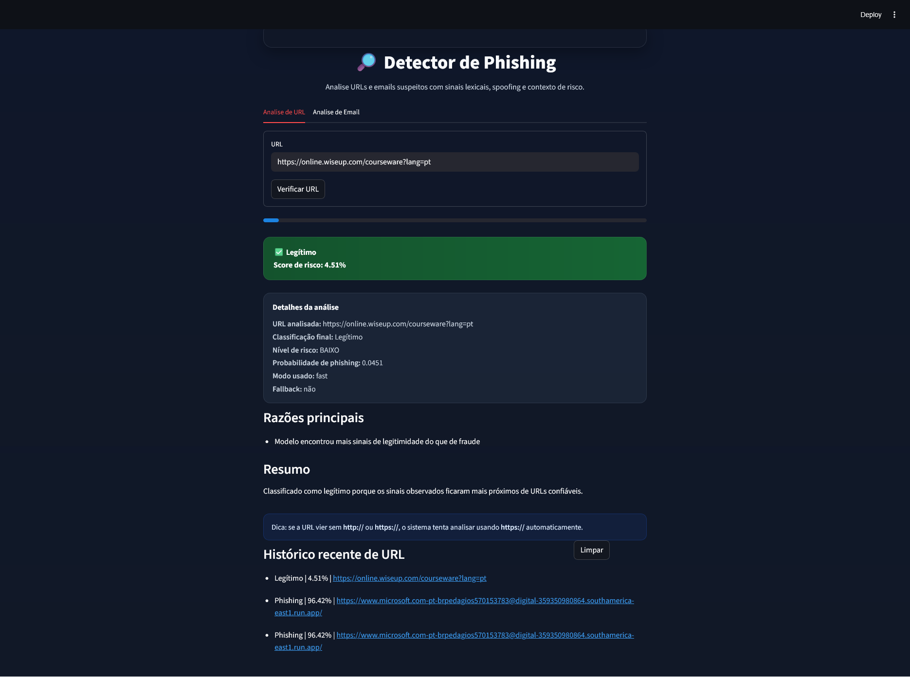
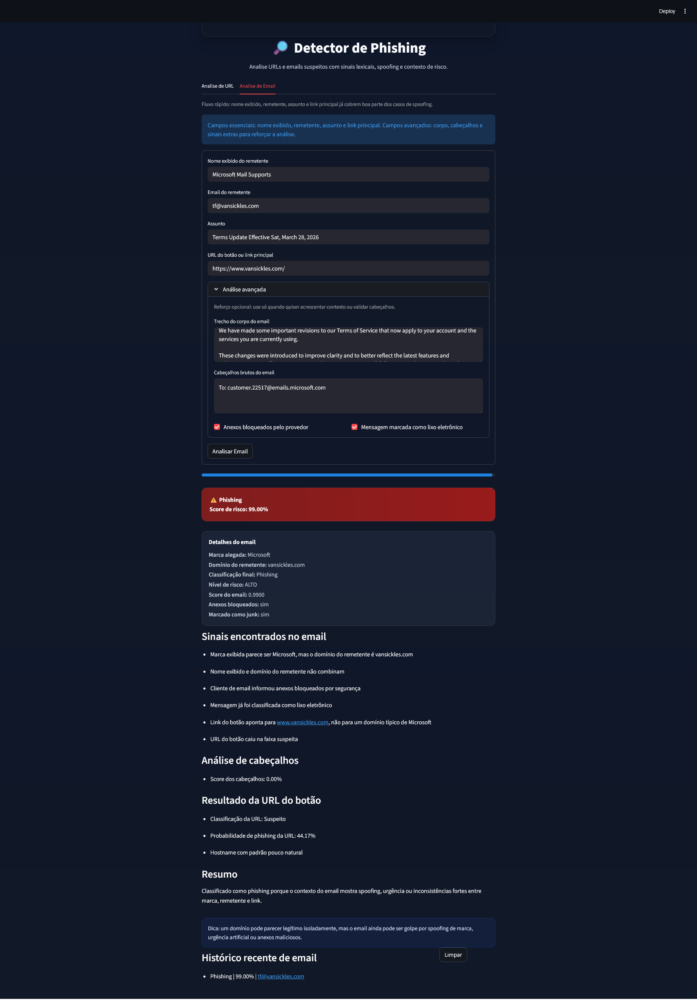
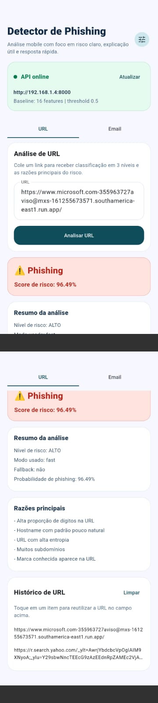
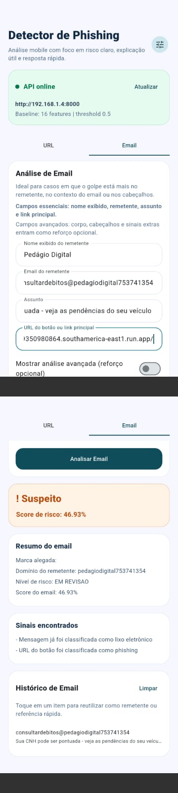
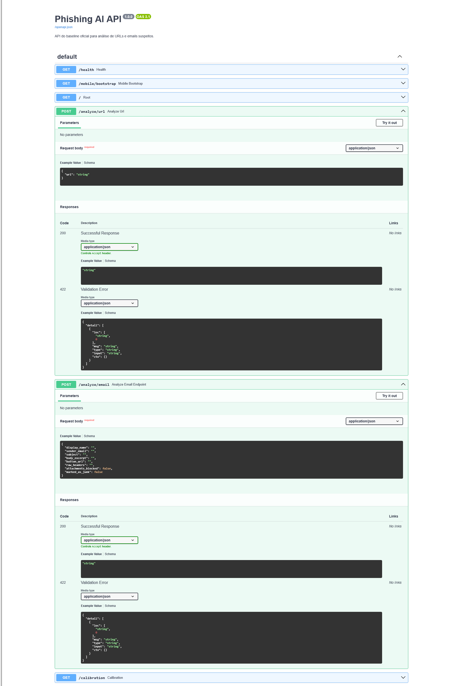

# Phishing Detection Platform

End-to-end phishing detection project combining machine learning, email spoofing heuristics, API design, and multi-platform interfaces.

This repository includes:
- URL phishing detection with an official `RandomForest` baseline
- email analysis with spoofing and header inspection
- desktop app with `Tkinter`
- web app with `Streamlit`
- backend API with `FastAPI`
- mobile client with `Flutter`

## Why this project stands out

- It goes beyond a notebook or a single script: the same detection engine powers desktop, web, API, and mobile experiences.
- It combines model-based URL analysis with rule-based email context analysis.
- It includes ablation, benchmarking, calibration cases, automated tests, and local/mobile history.
- It was validated not only locally but also through a mobile app running on a real Android device.

## Official baseline

Current official baseline:
- model: `RandomForest`
- feature set: `16` fast offline URL features
- threshold: `0.50`
- dataset: restored validated baseline dataset in [`data/urls_raw.csv`](./data/urls_raw.csv)

Recent full-dataset metrics:
- `accuracy`: `0.9227`
- `balanced_accuracy`: `0.8981`
- `precision_phishing`: `0.8820`
- `recall_phishing`: `0.8411`
- `f1_phishing`: `0.8610`
- `roc_auc_phishing`: `0.9715`

UI risk bands:
- `Legítimo`: `prob_phishing < 0.40`
- `Suspeito`: `0.40 <= prob_phishing < 0.60`
- `Phishing`: `prob_phishing >= 0.60`

## Architecture

```text
User Input
  ├─ URL analysis
  │   └─ feature_extraction_hybrid.py
  │      └─ detector_phishing_v2.py
  │         └─ RandomForest + calibrated probability
  │
  └─ Email analysis
      ├─ email_analysis.py
      ├─ email_headers.py
      └─ optional button URL analysis via detector_phishing_v2.py

Output layer
  ├─ Tkinter desktop app
  ├─ Streamlit web app
  ├─ FastAPI backend
  └─ Flutter mobile app
```

## Key capabilities

### URL detection
- lexical and structural URL feature extraction
- 3-level final classification
- main reasons behind the decision
- fallback path for uncertain cases

### Email detection
- display-name vs sender-domain mismatch detection
- claimed-brand heuristics
- suspicious subject/body pattern checks
- optional raw-header inspection for:
  - `Reply-To`
  - `Return-Path`
  - `SPF`
  - `DKIM`
  - `DMARC`
- optional button URL analysis

### Product layer
- structured analysis logs
- separate history for URLs and emails
- calibration cases and regression checks
- Android mobile client with configurable API base URL

## Repository structure

```text
phishing_ai/
├── app/
│   ├── interface.py
│   └── web_app.py
├── data/
│   ├── calibration_cases/
│   ├── experiments/
│   └── urls_raw.csv
├── docs/
│   ├── portfolio/
│   └── screenshots/
├── mobile_app_flutter/
├── model/
│   ├── ablation_v2.json
│   ├── feature_names_v2.pkl
│   ├── metrics_v2.json
│   └── phishing_model_v2.pkl
├── src/
├── tests/
├── api_fastapi.py
├── benchmark_models_v2.py
├── run_calibration_cases.py
├── train_model_v2.py
└── README.md
```

## Screenshots

Suggested screenshot files for portfolio presentation:
- `docs/screenshots/web-url-analysis.png`
- `docs/screenshots/web-email-analysis.png`
- `docs/screenshots/mobile-url-analysis.png`
- `docs/screenshots/mobile-email-analysis.png`

### Preview

#### Web app - URL analysis



#### Web app - email analysis



#### Mobile app - URL analysis



#### Mobile app - email analysis



#### FastAPI / Swagger



The folder structure is already prepared in [`docs/screenshots`](./docs/screenshots).

## How to run

### Install dependencies

```powershell
cd .\phishing_ai
pip install -r requirements.txt
```

### Run automated tests

```powershell
pytest .\tests\
```

### Run calibration cases

```powershell
python .\run_calibration_cases.py
```

### Retrain the official baseline

```powershell
python .\train_model_v2.py --full-dataset --fast-features --fixed-threshold --threshold 0.50
```

### Run the desktop app

```powershell
python .\app\interface.py
```

### Run the web app

```powershell
streamlit run .\app\web_app.py
```

### Run the API

```powershell
python .\api_fastapi.py
```

Swagger docs:
- [http://127.0.0.1:8000/docs](http://127.0.0.1:8000/docs)

### Run the Flutter mobile app

```powershell
cd .\mobile_app_flutter
flutter pub get
flutter run
```

### Build the Android APK

```powershell
cd .\mobile_app_flutter
flutter build apk --release
```

Generated release APK:
- `mobile_app_flutter/build/app/outputs/flutter-apk/app-release.apk`

## Experiments and research workflow

### Feature ablation

```powershell
python .\ablation_study_v2.py --full-dataset --fixed-threshold --threshold 0.50 --scenario-set extended
```

### Model benchmark

```powershell
python .\benchmark_models_v2.py --full-dataset --fixed-threshold --threshold 0.50
```

### Balanced merge experiment

```powershell
python .\create_balanced_merge_experiment.py --strategy match_phishing
```

Important project conclusion:
- the external merged dataset did not outperform the restored official baseline
- the repository keeps those experiments separated from the production baseline

## API endpoints

- `GET /`
- `GET /health`
- `GET /mobile/bootstrap`
- `POST /analyze/url`
- `POST /analyze/email`
- `GET /calibration`

## Technologies used

- Python
- Scikit-learn
- FastAPI
- Streamlit
- Tkinter
- Flutter
- Shared Preferences
- Pytest
- Pandas
- Joblib
- Requests
- BeautifulSoup
- WHOIS / DNS-related enrichment

## Portfolio notes

Files prepared to help with portfolio presentation:
- GitHub description: [`docs/portfolio/github_description.md`](./docs/portfolio/github_description.md)
- CV / LinkedIn text: [`docs/portfolio/cv_linkedin_texts.md`](./docs/portfolio/cv_linkedin_texts.md)
- Screenshot checklist: [`docs/screenshots/README.md`](./docs/screenshots/README.md)

## What not to commit

Recommended to keep out of GitHub:
- local caches
- build folders
- generated APKs
- logs
- local config files
- personal `.env` values

This repository already ignores the main local/build artifacts in [`.gitignore`](./.gitignore).
